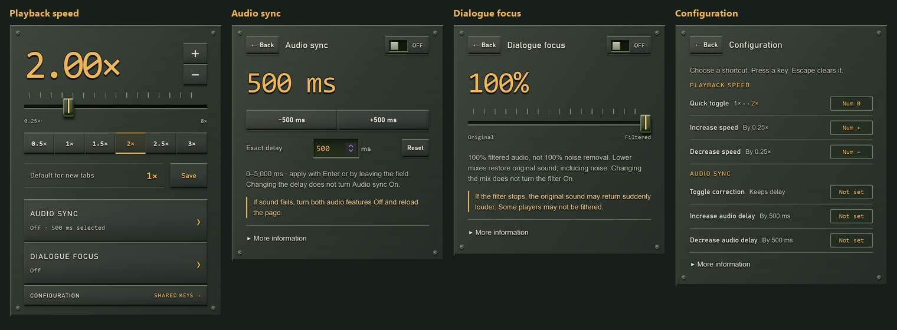

# Playback Plus

**Your playback, your pace.** Control playback speed, sound timing and dialogue in Firefox—independently for each tab.

**Version 1.8.0 · Firefox 142+** · **[Download unsigned XPI](https://github.com/HalcyonXP/playback-plus/releases/download/v1.8.0/playback-plus-1.8.0.xpi)**

*Four views, one compact Graphite panel. Shown with example settings; click the image for a closer look.*

## Make playback work for you

- **Playback speed:** watch or listen at **0.25×–8×**, with quick presets and a one-key toggle back to normal speed.
- **Audio sync:** when sound arrives before the picture, add up to **5 seconds** of delay. Adjust in 500 ms steps or enter an exact value.
- **Dialogue focus:** reduce background noise with local RNNoise speech enhancement. Use the mix slider to blend original and filtered sound.
- **Your controls:** a compact panel with configurable keyboard shortcuts. Playback changes affect your current tab, not your other open tabs.

## Install

**This release is unsigned.** Permanent installation requires **Firefox Developer Edition or Nightly 142+**. Standard Firefox requires a signed extension; use the temporary option below to try it instead.

If you use the separate **Audio Sync** add-on, disable it first to avoid conflicting audio processing.

1. [Download Playback Plus 1.8.0 (.xpi)](https://github.com/HalcyonXP/playback-plus/releases/download/v1.8.0/playback-plus-1.8.0.xpi) and save the file.
2. In Developer Edition or Nightly, open `about:config` and set `xpinstall.signatures.required` to `false`. **This disables signature enforcement; only do so if you understand the security implications.**
3. Open `about:addons` → gear menu → **Install Add-on From File…** and select the XPI.
4. Accept the permissions, reload your media tabs, then open **Playback Plus** from Firefox’s Extensions menu.

[Release notes and SHA-256 checksum](https://github.com/HalcyonXP/playback-plus/releases/tag/v1.8.0)

Try it temporarily in standard Firefox

1. Download **Source code (zip)** from the [release page](https://github.com/HalcyonXP/playback-plus/releases/tag/v1.8.0) and extract it.
2. Open `about:debugging#/runtime/this-firefox` in Firefox.
3. Select **Load Temporary Add-on…** and choose the extracted `manifest.json`.
4. Reload your media tabs.

Temporary installation lasts until Firefox closes. No change to signature settings is needed for this option.

## Everyday controls

Open the extension to change speed, or choose **Audio sync**, **Dialogue focus** or **Configuration**.

| Shortcut | Action |
| --- | --- |
| **Numpad 0** | Toggle between 1× and this tab’s last alternate speed |
| **Numpad + / −** | Increase or decrease speed by 0.25× |

Shortcuts work while the webpage has focus. Customize them in **Configuration**; audio shortcuts start unassigned. Click a binding and press a key to change it, or press **Escape** during capture to clear it.

- **Default for new tabs:** choose a speed, then click **Save** beneath the presets. The displayed default stays fixed until you save again—even when playback speed changes. Existing tabs keep their own speed.
- Fresh installs start with a **1×** default. Upgrading keeps an existing saved default, or fixes the previously used new-tab starting speed as the initial default.
- Choose a preset from **0.5×, 1×, 1.5×, 2×, 2.5× or 3×**, or adjust in 0.25× steps with +/−. Both glide the knob while playback changes immediately; reduced-motion settings skip the glide.
- Audio sync and Dialogue focus start **Off**. Changing a value does not turn either feature on.
- Audio settings survive a same-page reload but reset when you navigate to a different page. Switching tabs does not stop processing.

## Good to know

- Support varies by website. Protected pages, DRM video and some players cannot be controlled.
- Audio sync **delays sound only**; it cannot advance late audio.
- Dialogue focus enhances mixed audio—it does not isolate a chosen speaker or guarantee noise removal. It can affect voices and music, and adds about **30 ms** of processing delay even at 0% mix, plus browser/device latency.
- **If filtering fails, original sound can return suddenly louder.** Start at a comfortable volume. If audio sounds wrong or disappears, turn **both audio features Off and reload the page** to restore native playback. Turning Off alone does not fully restore the native audio path after activation.

## Privacy

Audio processing stays on your device. No audio uploads, recordings or analytics. Website access lets the extension find media; tab/session access keeps each tab’s settings independent. Speed preferences and shortcuts may sync through your Firefox Account. Audio settings stay tab-local.

[Report a problem or suggest a feature](https://github.com/HalcyonXP/playback-plus/issues) · [RNNoise credits and licenses](content/vendor/rnnoise/PROVENANCE.md)
